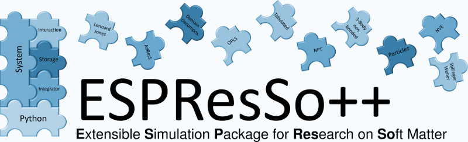

|

ESPResSo++
==========

Welcome to the user documentation of ESPResSo++

.. toctree::
   :maxdepth: 2
   :titlesonly:

   instalation.rst
   tutorial.rst
   classdescription.rst

   doxygen 

   pdf

   credits.rst

.. |espp| replace:: ESPResSo++

**Please cite this, if you used ESPResSo++ in your research**

| H.V.Guzman, N.Tretyakov, H.Kobayashi, A.C.Fogarty, K.Kreis, J.Krajniak, C.Junghans, K.Kremer, T.Stuehn,
| "ESPResSo++ 2.0: Advanced methods for multiscale molecular simulation",
| *Computer Physics Communications*, **238** (2019), pp. 66-76
| `DOI: 10.1016/j.cpc.2018.12.017 <https://doi.org/10.1016/j.cpc.2018.12.017>`_

| J.D.Halverson, T.Brandes, O.Lenz, A.Arnold, S.Bevc, V.Starchenko, K.Kremer, T.Stuehn, D.Reith, 
| "ESPResSo++: A Modern Multiscale Simulation Package for Soft Matter Systems", 
| *Computer Physics Communications*, **184** (2013), pp. 1129-1149
| `DOI: 10.1016/j.cpc.2012.12.004 <http://dx.doi.org/10.1016/j.cpc.2012.12.004>`_

|

`Recent publications where ESPResSo++ was cited <https://scholar.google.com/scholar?cites=16263384330356203698&as_sdt=2005&sciodt=0,5&hl=en>`_

.. image:: _static/mpi-p_logo.png
